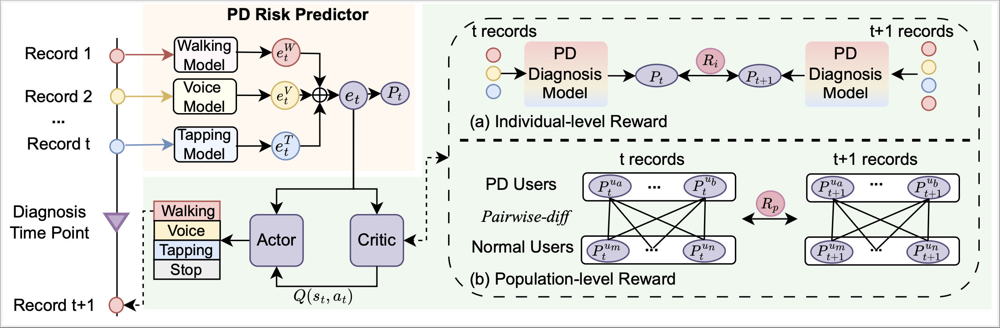
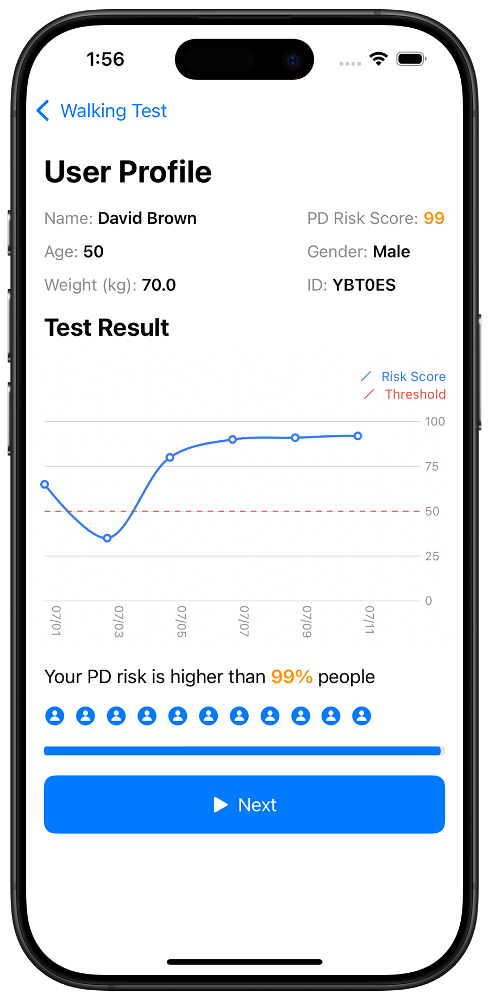
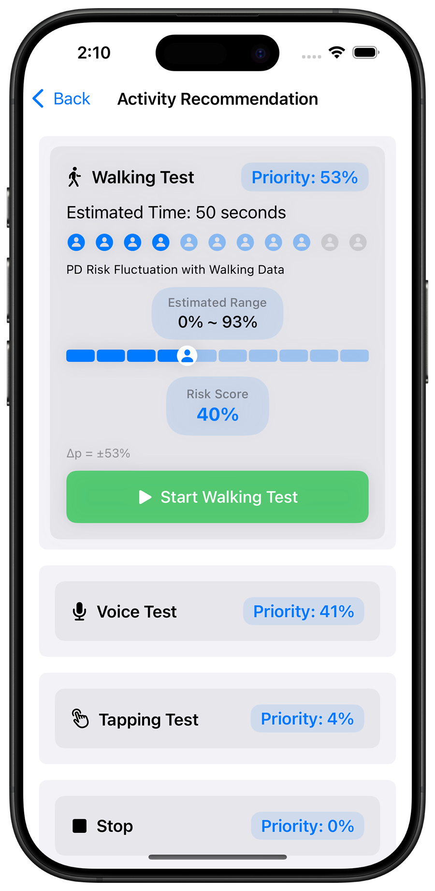

# PDSensing: Smartphone-Based Parkinson's Disease Detection with Active Sensing

## Abstract

Parkinson’s disease (PD) is the second most common and irreversible neurodegenerative disorder. Timely PD detection is crucial for clinical management, including medical interventions and monitoring. Smartphone-based assessments provide a promising, accessible, and cost-effective approach for early PD detection. Existing smartphone-based PD detection methods often require dozens of multi-modal tests, such as repeated walking, tapping, and voice activity tests, which can burden users and lead to reduced detection performance when limited tests are completed. This raises a key challenge in PD detection: how to achieve promising PD detection performance with fewer tests. In this study, we first propose a PD active sensing model (PDSensing) with an Actor-Critic framework that actively recommends the most informative PD tests to the user, optimizing the balance between PD detection performance and user burden. The framework consists of three main modules: (1) a PD Risk Predictor that predicts PD risks with test records, (2) an Actor module that recommends the most informative modality to users for next-round activity test to improve the Predictor's performance and (3) a Critic module that learns to estimate the rewards for each additional modality test to guide the Actor's training. Experiment results on real-world data show that our approach achieves comparable performance to baselines with only about 37.5%-50% tests, significantly reducing user burden. Moreover, we have developed a mobile app to effectively interact with users by displaying PD risk and recommending additional next-round informative activities if necessary, paving the way for actionable clinical decision-making support for early PD management. 

## Structure

### 1. `algortithm/`
Contains the **algorithm code** for traning a PDSensing model. 

#### Train the Predictor and Critic
`python train_critic.py`

#### Train the Actor
`python train_actor.py`

### 2. `app/`
Contains the **source code** for the PDSensing iOS application, developed using **Xcode**.  

## Example of user interface. 

  

    
    
  

Our implementation integrates the proposed framework into a user-centered interface design. Our interface design focuses on two primary objectives: (1) PD risk assessment (2) next-round  activity recommendations. The UI example (a) presents the PD diagnosis results via a risk assessment dashboard, which implements a hierarchical information structure to facilitate risk monitoring. After reviewing the current PD result, as shown in the UI example (b), the user would go to the "Activity Recommendation" page for active sensing.

## Email
If you have any questions, please email to: [chen.11773@osu.edu](mailto:chen.11773@osu.edu)
